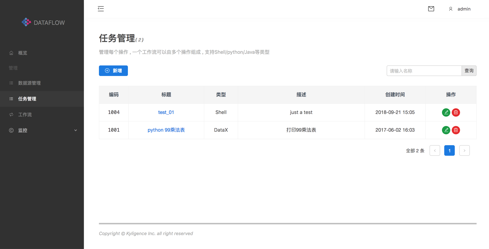

#### 动作

##### 新增动作

如下图所示：在左边的导航栏选择**动作管理**，然后点击右边页面**新增**

*标题*

在弹出的新增页面上添加标题，能代表action的执行意义，比如: list_tables。

*类型*

可以选择为shell/java/python

*描述*

对action的说明

*自定义参数*

自定义参数可以传入待执行的脚本里

*代码*

脚本的实体部分，如shell脚本：`hive -e "show tables;"`

**查询动作**

根据标题名称可查询动作，如下图:

**删除任务动作**

点击**删除**按钮，即可删除当前动作。

**编辑动作**

点击**编辑**按钮，即可重新编辑当前动作。

