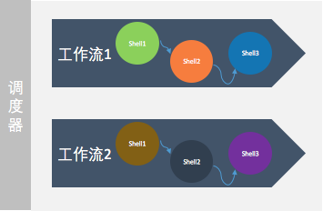

#### Kyligence Dataflow简介

**Kyligence Dataflow** 是企业级的调度工具，它可以无缝的链接数据从生产到消费的全过程，同时帮助用户管理，监控调度任务的执行情况。

大数据从生产到存储最后到使用，通常需要经历ETL处理，建模后再到**Kyligence Enterprise**落地查询。期间涉及很多数据处理的动作，这些动作往往通过脚本去执行。**DATAFLOW**可以自下而上无缝的管理和控制这些动作的执行。

换句话说，**DATAFLOW**可以调度整个数据生产过程。

下图是产品架构图：

#### 功能描述

##### 灵活的调度

支持按照时间、依赖关系的任务触发机制，按照DAG关系准确、准时运行。支持分钟、小时、天、周和月多种调度周期配置。

##### 支持多种任务类型

支持**数据同步**、**数据抽取**、**数据清洗**、**数据建模**等多种任务类型，通过任务之间的相互依赖完成复杂的数据处理。

##### 可视化开发

提供可视化的脚本代码开发、工作流设计器页面，无需搭配任何开发工具，简单的拖拽和开发就可以完成复杂的数据分析任务。只要有浏览器有网络，便可随时随地进行开发工作。

##### 监控告警

运维中心提供可视化的任务监控管理工具，支持以DAG图的形式展示任务运行时的全局情况。

可方便地配置邮件报警，任务发生错误可及时通知相关负责人，保证业务正常运行。