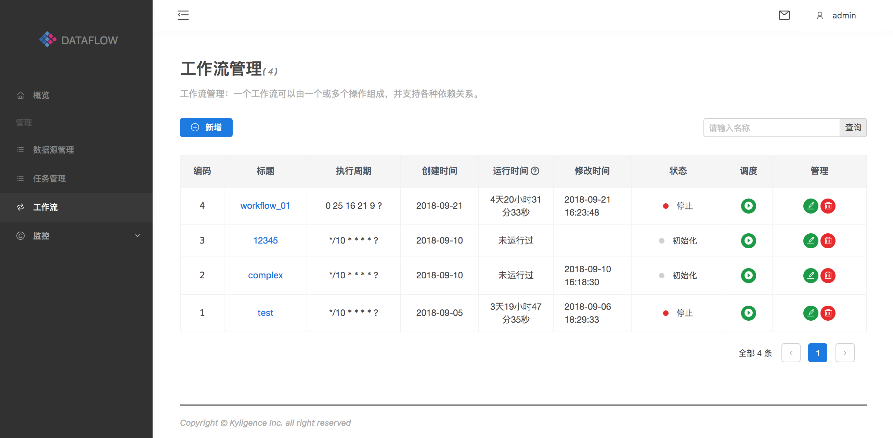

#### 任务调度

##### 启动工作流任务

如下图所示：在左边的导航栏选择**工作流**，然后点击右边页面**启动任务**按钮。

工作流一旦启动，不会立即执行，而是要等待cron设定的执行周期来进行调度。比如：cron设置的是每天夜里1点执行，则workflow被启动后，每天夜里1点将执行一次。

**停止工作流任务**

如下图所示：在左边的导航栏选择**工作流**，然后点击右边页面**停止任务**按钮。注意：点击**停止任务**按钮，停止的是cron的调度任务，如果当前存在正在执行的工作流任务，将不会被停止，而是等待任务执行完毕。

**正在执行工作流任务**

如下图所示：在左边的导航栏选择**正在执行**，页面右边会列出正在执行的工作流任务。

可以通过点击**暂停**按钮来暂停正在执行的工作流任务，在此点击**恢复**按钮来恢复执行被暂停的工作流任务。

通过点击工作流名字，比如图中的“Demo” ，来查看工作流中正在被执行的动作，如下图：

图中列出来当前正在执行的工作流任务中的动作的执行情况，用户可以通过点击**暂停**某一个动作，如下图

> 注意：一旦某个动作被暂停，那么依赖于这个动作的后续动作都将被暂停。

同样，可以通过点击恢复执行某个动作。

点击查看动作详细信息，如下图：

**工作流任务执行历史**

如下图所示：在左边的导航栏选择**执行历史**，页面右边会列出工作流任务的执行历史。

如果工作流任务执行成功，用户可以通过点击**删除**工作流的执行历史。

如果工作流任务执行失败，如下图：

用户可以通过点击**重试**按钮重新执行工作流。点击重试后，该工作流将会被立即执行，而不需要等待cron调度。点击**删除**按钮将移除该失败任务。

