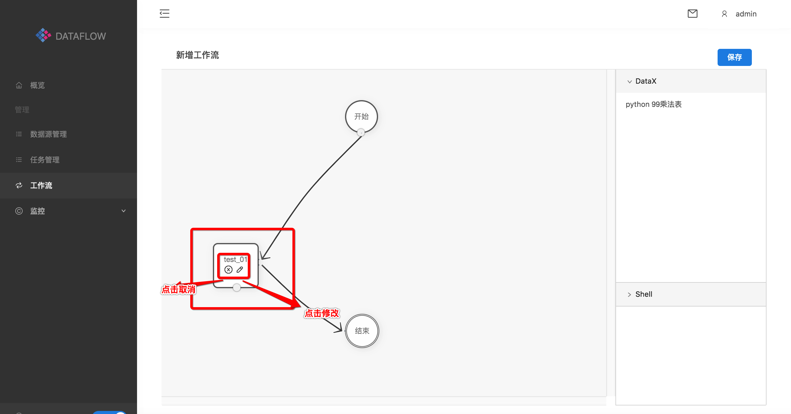
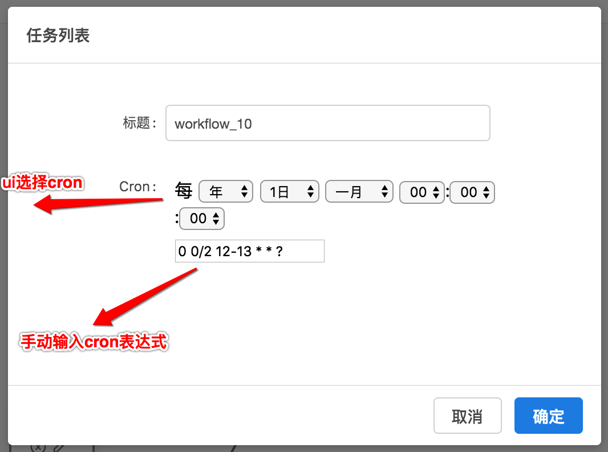
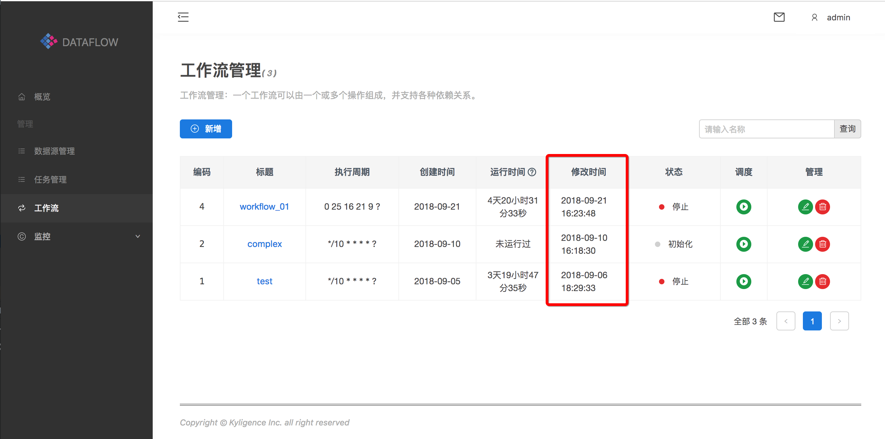

#### 工作流

##### 新增工作流

如下图所示：在左边的导航栏选择**工作流**，然后点击右边页面**新增**

**添加任务到工作流**

工作流以**开始**作为开始执行的起点，**结束**作为执行结束的标记。从右边的动作列表中选择要添加的任务。

选择右边的任务，左键按住拖到工作流画布里。如果要关联任务，可以左击按住拖到另一个任务上，尖头方向表征了执行的依赖关系。如下图：执行顺序为：**开始 -> Sleep_30 -> python 99乘法表 ->结束**

如果创建action时，添加参数以及描述，可以手动修改

点击编辑会出现下面提示框

修改你需要的参数，点击确定保存修改

注意：此处的参数修改只会针对该workflow工作流，对于创建的action的参数依旧保持原有的值

任务添加结束后，即可点击**保存**按钮，弹出如下的对画框：

在弹出对话框中，需要输入工作流的标题以及它的执行周期。对于执行周期的格式是cron表达式，一个cron表达式有至少6个（也可能是7个）由空格分隔的时间元素。从左至右，这些元素的定义如下：

> 秒（0–59）
>
> 分钟（0–59）
>
> 小时（0–23）
>
> 月份中的日期（1–31）
>
> 月份（1–12或JAN–DEC）
>
> 星期中的日期（1–7或SUN–SAT）
>
> 年份（1970–2099）

可以根据提供的cron选择器简单的选择执行周期

填写完cron表达式后，即可点击**确定**按钮，保存工作流。

##### 编辑工作流

工作流定义好，可以通过点击**编辑**按钮重新编辑工作流。编辑完成后点击**保存**按钮即可。

注意：点击编辑后，workflow的修改时间会根据点击编辑时间改变

**删除工作流**

工作流定义好，可以通过点击**删除**按钮移除工作流。